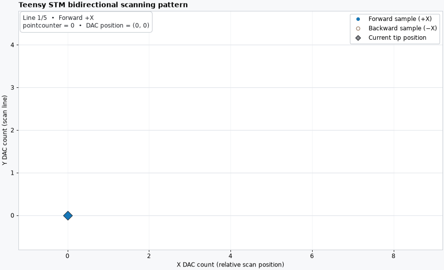

# Clustered STM Project

This repository organizes materials for the COSMOS 2026 scanning tunneling
microscope project, including source locations, controller-related files,
future measurement output, and surface-reconstruction work.

## Current status

- The poster's course-source citations and their locations in the supplied ZIP
  are documented.
- The Teensy controller firmware defines forward-scan, backward-scan, and
  parameter-file output.
- The planned Teensy-output and Python-conversion workflow is outlined on the
  poster using explicit placeholders.
- Complete STM scan files and a tested reconstruction program still need to be
  added.
- No Python converter or plotter has been implemented yet.

## Data and visualization

The STM's recorded values are the original measurement output. A two-dimensional
map or three-dimensional surface is a processed representation made from those
measurements, not a direct photograph from the instrument. When complete data
become available, this repository will keep the raw files, processing code,
processing settings, and generated figures together so the transformation can
be checked and reproduced.

The planned converter will use the three files produced for one scan:
`STMF*.hex` for forward binary values, `STMB*.hex` for backward binary values,
and `STMP*.txt` for scan dimensions and parameters. The two `.hex` files contain
raw signed 16-bit values rather than human-readable hexadecimal text.

## Repository layout

- `poster/main.tex`: authoritative poster source.
- `poster/software-control-flow-large.png`: software-architecture figure used
  by the poster.
- `poster/software-state-sequence.png`: control-state figure used by the
  poster.
- `animate_scan_pattern.py`: firmware-derived scan-order animation.
- `scan-pattern-preview.gif`: rendered preview of that animation.
- `requirements-animation.txt`: Python dependencies for the animation.
- `notunnelpy/`: synthetic input generator, validated STM file reader,
  diagnostic plotter, and tests for development before tunneling works.
- `CITATION_SOURCE_PATHS.txt`: exact locations of cited course sources.
- `POSTER_FORMATTING_AND_WORKFLOW_RULES.txt`: poster layout and content rules.

### Teensy scanning-pattern animation

[`animate_scan_pattern.py`](animate_scan_pattern.py) reproduces the scan order
in the Teensy firmware's `Timer2Service`: acquire one line while stepping in
the +X direction, retrace and acquire while stepping in the -X direction,
reset X, increment Y, and repeat.

The firmware source is S. Chiang,
`Experiments/STM Project/Teensy_STM11A_July_29_2025.ino` in the supplied
course-material ZIP ([citation 2](CITATION_SOURCE_PATHS.txt)). The relevant
locations in that source copy are:

- lines 838-857: the `g` command initializes `pointcounter`, `linenumber`,
  `fscan`, X, and Y, then starts the `Timer2Service` acquisition timer;
- lines 1178-1203: `Timer2Service` writes the current X value, advances or
  retracts X, records forward/backward data, and switches direction; and
- lines 1203-1229: after two passes, it resets the point counter, increments Y,
  resets X, pulses the line trigger, and advances the line number.

Install its dependencies and open the interactive animation:

```console
python -m pip install -r requirements-animation.txt
python animate_scan_pattern.py
```

To export a shareable animation:

```console
python animate_scan_pattern.py --output scan-pattern.gif
```

The defaults use fewer points than the firmware's 512-by-512 default so the
motion is easy to follow. Use `--points`, `--lines`, `--step-size`,
`--initial-x`, and `--initial-y` to change the modeled scan.



The animation also displays the firmware's literal `pointcounter` value. In
the cited Teensy source, lines 1194-1198 index `DataArray1B` with values from
`numpoints` through `2 * numpoints - 1`. That exceeds the 512-element second
array dimension at the default `numpoints = 512`; the firmware should use a
zero-based backward index before relying on those stored array entries.

## Poster citations

The poster currently uses four numbered references. References `[1]` through
`[3]` are course materials found in the supplied course-material ZIP. Reference
`[4]` is this repository itself, so it does not have a path inside that ZIP.

See [`CITATION_SOURCE_PATHS.txt`](CITATION_SOURCE_PATHS.txt) for the full
citation-to-source-path index.

## Poster source and working rules

The current upload-ready LaTeX source and its PNG diagrams are kept in
[`poster/`](poster/). The comprehensive formatting, content, citation, data,
and workflow conventions are recorded in
[`POSTER_FORMATTING_AND_WORKFLOW_RULES.txt`](POSTER_FORMATTING_AND_WORKFLOW_RULES.txt).

## Files still to add

- complete forward- and backward-scan files;
- the matching parameter file;
- the tested Python reconstruction program;
- vertical-piezo calibration information;
- final 2D and optional 3D surface figures; and
- processing notes and settings used to generate those figures.
